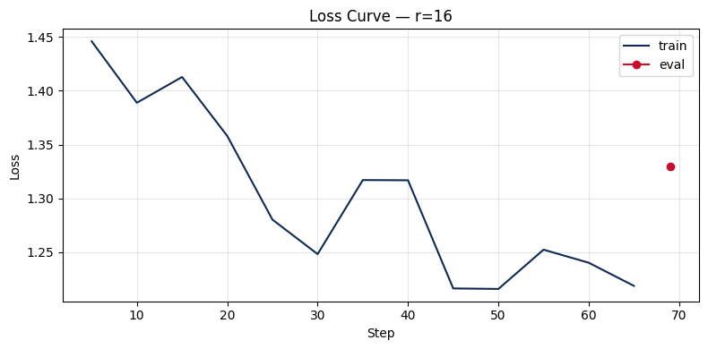


# Lab 21 - Evaluation Report

**Hoc vien**: Le Nguyen Chi Bao - 2A202600103
**Ngay nop**: 2026-05-07  
**Submission option**: A (lightweight ZIP)

## 1. Setup
- **Base model**: `unsloth/Qwen2.5-7B-bnb-4bit` (theo notebook T4 profile)
- **Dataset**: custom Vietnamese instruction dataset, **200 samples** (split 90/10 -> 180 train, 20 eval)
- **max_seq_length**: 1024 (chon theo p95 token length, cap = 1024)
- **GPU**: Tesla T4 (16 GB)
- **Training cost uoc tinh**: ~20.55 phut cho 3 rank (`r=8,16,64`). Neu chay Colab Free: ~$0.

## 2. Rank Experiment Results

| Rank | Alpha | Trainable Params | Train Time (min) | Peak VRAM (GB) | Eval Loss | Perplexity |
|------|-------|------------------|------------------|----------------|-----------|------------|
| 8    | 16    | 2,523,136        | 6.71             | 12.64          | 1.3593    | 3.8935     |
| 16   | 32    | 5,046,272        | 7.06             | 11.57          | 1.3295    | 3.7793     |
| 64   | 128   | 20,185,088       | 6.77             | 13.93          | 1.3184    | 3.7374     |

**Nhan xet nhanh ve trade-off**:
- `r=8 -> r=16`: perplexity giam ~2.93%, params tang 2x.
- `r=16 -> r=64`: perplexity chi giam them ~1.11%, nhung params tang 4x va VRAM tang ~20.4%.
- `r=64` tot nhat ve metric tuyet doi, nhung `r=16` cho ROI can bang hon.

## 3. Loss Curve Analysis

- Duong loss train/eval (theo `loss_curve.png`) giam dan va khong cho thay dau hieu diverge manh.
- Eval loss cuoi cung giua 3 rank deu on dinh trong khoang hep (1.318 - 1.359), cho thay training da hoi tu.
- Co dau hieu **diminishing returns** khi tang rank: tu `r=16` len `r=64`, cai thien perplexity nho so voi chi phi tai nguyen bo sung.
- Khong co bang chung overfitting ro rang tu cac chi so tong hop hien co; tuy nhien de ket luan chat hon can log eval theo tung epoch/step.

## 4. Qualitative Comparison (5 examples)

| # | Prompt | Verdict | Nhan xet ngan |
|---|--------|---------|---------------|
| 1 | Giai thich machine learning cho nguoi moi bat dau | `slight_win` | Ban fine-tuned ro y hon mot chut, nhung van tong quat. |
| 2 | Viet code Python tinh Fibonacci thu n | `win` | Cau truc ma de doc hon, co guard clauses thuc te. |
| 3 | Liet ke 5 nguyen tac UI/UX | `slight_loss` | Co lap y, chat luong noi dung chua tot hon base. |
| 4 | Tom tat khac biet LoRA va QLoRA | `loss` | Co dau hieu dung tu sai/nguy co hallucination. |
| 5 | Phan biet prompt engineering, RAG, fine-tuning | `tie` | Hai ban tra loi gan tuong duong, muc do chi tiet cao cap. |

Tong quan 5 prompts: 1 `win`, 1 `slight_win`, 1 `tie`, 1 `slight_loss`, 1 `loss`.  
=> Fine-tune cai thien mot so prompt co cau truc ro (nhat la coding), nhung chua on dinh tren cac prompt khai niem.

## 5. Conclusion ve Rank Trade-off

Voi bo ket qua nay, rank toi uu de trien khai thuc te la **r=16**. Ly do chinh la `r=16` dat muc perplexity rat gan `r=64` (3.779 so voi 3.737, chenh lech chi ~1.11%), trong khi chi phi mo hinh va tai nguyen tang manh neu day len `r=64` (trainable params tang 4 lan, VRAM tang hon 20%). Neu uu tien tuyet doi metric, `r=64` van dung dau; tuy nhien trong bai toan lab va deployment thuc te tren GPU han che, ROI cua `r=16` thuyet phuc hon vi can bang duoc chat luong, bo nho va tinh on dinh. Du lieu qualitative cung cho thay fine-tuning co cai thien cuc bo (dac biet prompt coding), nhung chua dong deu tren moi nhom cau hoi, do do viec tang rank cao chua chac mua duoc su cai thien tuong ung. Recommendation: giu `r=16` lam cau hinh mac dinh, chi can nhac `r=64` khi co ngan sach VRAM rong va muc tieu la toi uu metric nho nhat.

## 6. What I Learned
- LoRA rank cao hon khong dong nghia voi hieu qua cao hon theo ROI; can xem dong thoi perplexity, VRAM va so params.
- Danh gia qualitative can bao gom ca case win, tie, loss de tranh ket luan thien lech.
- Trong thuc hanh fine-tuning, mot cau hinh can bang (nhu `r=16`) thuong de deploy hon cau hinh chi toi uu metric tuyet doi.
